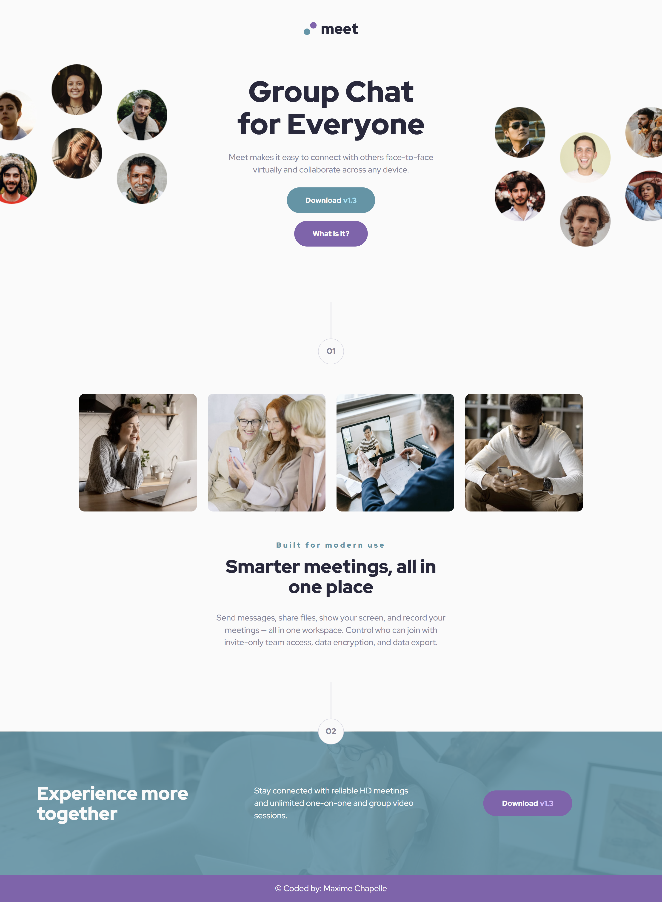

# Frontend Mentor - Meet landing page solution

This is a solution to the [Meet landing page challenge on Frontend Mentor](https://www.frontendmentor.io/challenges/meet-landing-page-rbTDS6OUR). Frontend Mentor challenges help you improve your coding skills by building realistic projects.

## Table of contents

- [Overview](#overview)
  - [The challenge](#the-challenge)
  - [Screenshot](#screenshot)
  - [Links](#links)
- [My process](#my-process)
  - [Built with](#built-with)
  - [What I learned](#what-i-learned)
  - [Continued development](#continued-development)
  - [Useful resources](#useful-resources)
  - [AI Collaboration](#ai-collaboration)
- [Author](#author)
- [Acknowledgments](#acknowledgments)

## Overview

### The challenge

Users should be able to:

- View the optimal layout depending on their device's screen size
- See hover states for interactive elements

### Screenshot



### Links

- Solution URL: [Frontend Mentor solution](https://www.frontendmentor.io/solutions/meet-landing-page-sass-flexbox-grid-mobile-first-workflow-L4Oq-acxna)
- Live Site URL: [meet-landing-page](https://maxi1993-tech.github.io/meet-landing-page/)

## My process

### Built with

- Semantic HTML5 markup
- CSS custom properties
- Flexbox
- CSS Grid
- SASS
- `clamp()`
- Mobile-first workflow

### What I learned

- Discovered `::before` to overlay a color on top of a background image — I need to dig deeper into this!

```css
.cta::before {
  content: "";
  position: absolute;
  width: 100%;
  height: 100%;
  top: 0;
  left: 0;
  background-color: var(--color-cyan-600);
  opacity: 0.9;
}
```

- `clamp()` is starting to make sense — I understood how to calculate the fluid `vw` value
- To hide horizontal overflow, `overflow-x: hidden` needs to go on `html` — not just `body`
- With `order` in flexbox you can reorder elements visually without touching the HTML

```css
.img-left { order: -1; }
.hero-content { order: 2; }
.img-right { order: 3; }
```

- Realized that `:hover` on `<li>` and `:focus` on `<a>` don't target the same element — took me a while to figure out

### Continued development

- SASS setup — I want to be able to do it again on my own on the next project
- Flexbox and Grid, I'm improving but still have a long way to go
- Accessibility is something I haven't explored much — contrast, alt text, focus states
- Magic values in CSS (`-190px`, `394px`…) — I want to understand how to anticipate and avoid them

### Useful resources

- [Kevin Powell](https://www.youtube.com/@KevinPowell) — his videos on Flexbox, Grid and CSS in general
- [Grafikart](https://grafikart.fr) — French resources, helpful for SASS and CSS
- [MDN Web Docs](https://developer.mozilla.org) — the reference for everything

### AI Collaboration

This is the project where I relied on Claude the least. I used it mainly when I was stuck — desktop layout, `::before` overlay, `:hover`/`:focus` confusion. It guides, it doesn't write the code for me.

## Author

- Frontend Mentor - [@maxi1993-tech](https://www.frontendmentor.io/profile/maxi1993-tech)
- GitHub - [@maxi1993-tech](https://github.com/maxi1993-tech)

## Acknowledgments

Thanks to Frontend Mentor for this premium challenge. It was a real challenge — more complex than I expected, and it pushed me to improve.